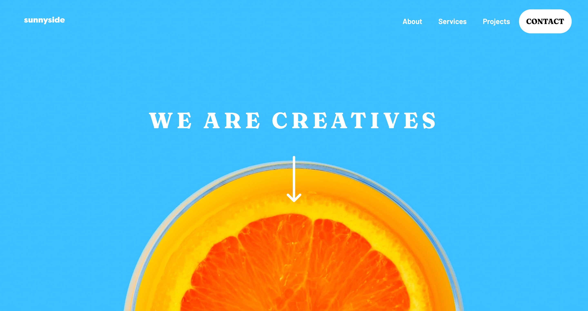

# Frontend Mentor - Sunnyside agency landing page solution

This is a solution to the [Sunnyside agency landing page challenge on Frontend Mentor](https://www.frontendmentor.io/challenges/sunnyside-agency-landing-page-7yVs3B6ef). Frontend Mentor challenges help you improve your coding skills by building realistic projects.

## Table of contents

- [Overview](#overview)
  - [The challenge](#the-challenge)
  - [Screenshot](#screenshot)
  - [Links](#links)
- [My process](#my-process)
  - [Built with](#built-with)
  - [What I learned](#what-i-learned)
  - [Continued development](#continued-development)
  - [Useful resources](#useful-resources)
- [Author](#author)
- [Acknowledgments](#acknowledgments)

**Note: Delete this note and update the table of contents based on what sections you keep.**

## Overview

### The challenge

Users should be able to:

- View the optimal layout for the site depending on their device's screen size
- See hover states for all interactive elements on the page

### Screenshot



### Links

- Solution URL: (https://your-solution-url.com)
- Live Site URL: (https://vigorous-aryabhata-e81226.netlify.app/sunnyside-agency-landing-page-main/)

## My process

### Built with

- Semantic HTML5 markup
- CSS custom properties
- Flexbox
- CSS Grid
- Mobile-first workflow
- Responsive Navigation Menu modified from (https://dev.to/codywilliamson/how-to-build-a-customizable-reusable-responsive-navbar-2ijc)

### What I learned
One of the major lessons I've learned from this project is using aspect ratio to build a layout and
image gallery. In order to do this, I looked at the dimensions of each image, divided the height by the width, and used the result as a percentage. That percentage is added as padding-top to maintain the aspect ratio of the background image in an empty div, and to match the sizing of the text containers for an evenly sized layout.

```css
.transform-copy, .stand-out-copy {
    width: 100%;
    display: flex;
    padding-top: var(--mobile-ratio);
    position: relative;
    justify-content: center;
    align-items: center;
    flex-direction: column;
}

.transform-copy > div, .stand-out-copy > div {
    position: absolute;
    top: 50%;
    transform: translateY(-50%);
    padding: 2rem;
    
}
```

### Continued development

I would like to continue practicing keeping an organized css file, as well as utilizing variables. HTML structure was also an important aspect of this project (and any other projects). 

### Useful resources

- [Resource 1](https://dev.to/codywilliamson/how-to-build-a-customizable-reusable-responsive-navbar-2ijc) - I copied the responsive navbar from this tutorial, and made adjustments to work with my own project. 
- [Resource 2](https://www.py4u.net/discuss/987368) - I used answer #1 from this page to figure out how to grab the correct aspect ratio for each background image and container that needed it for layout.

## Author

- Website - [Aubrey Barnes](https://aubreybarnes.dev/)
- Frontend Mentor - [@aubreyhbarnes](https://www.frontendmentor.io/profile/yourusername)
- Twitter - [@HbarnesAu](https://twitter.com/HbarnesAu)
